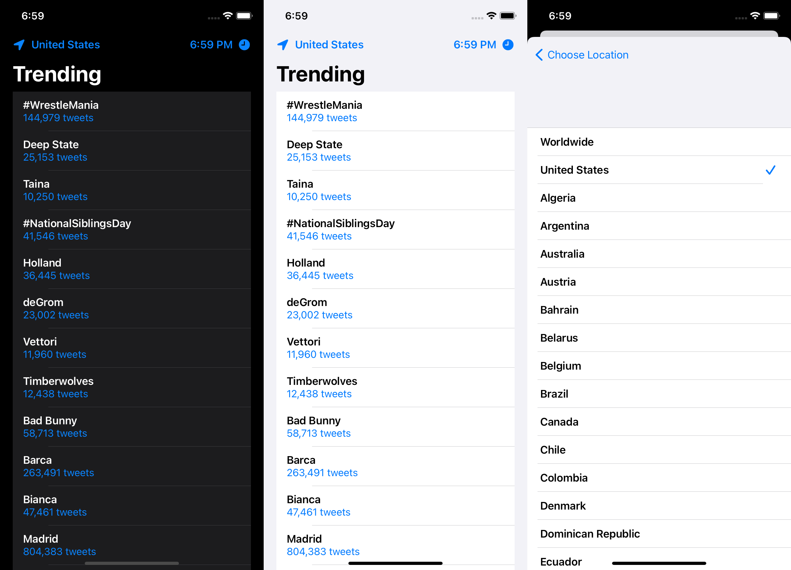

# Trends
SwiftUI application to view the latest trending topics on Twitter

This is my first attempt at a Swift UI application after watching Paul Hegarty's [Stanford CS193p Spring 2020 course](https://www.youtube.com/watch?v=yOhyOpXvaec&list=PLpGHT1n4-mAtTj9oywMWoBx0dCGd51_yG) on YouTube. It is heavily influenced by the work done in the Enroute App. You can change the location for the fetched trends and manually refetch data by tapping the associated nav bar items. Tapping any given entry will redirect you to Twitter for more information.

### How to Use
1. Firstly you must apply for a Twitter developer account if you do not already have API access. You will want to keep your api key and secret api key handy.
2. Download the supportRawData fork of Swifter provided at the bottom of this readme. You will need to relink the project inside Xcode.
3. Replace the nil values for apiKey and secretApiKey inside TrendsApp.swift with your own keys.
4. Run the app

#### Open Source Dependencies
Thank you to mattdonnelly for [Swifter](https://github.com/mattdonnelly/Swifter) and thebrandontyler for the fork the [supportRawData fork](https://github.com/thebrandontyler/Swifter/tree/supportRawData) this project depends on.
